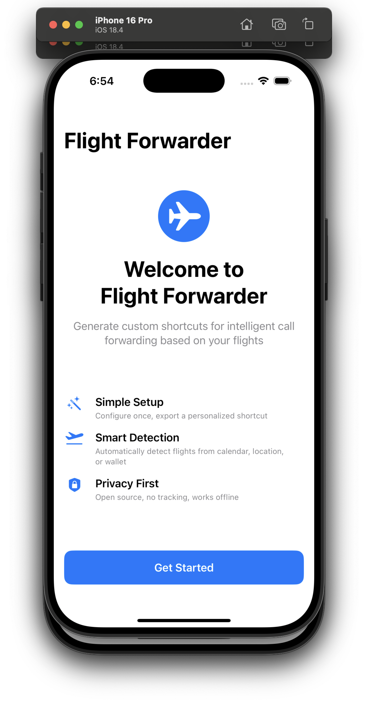
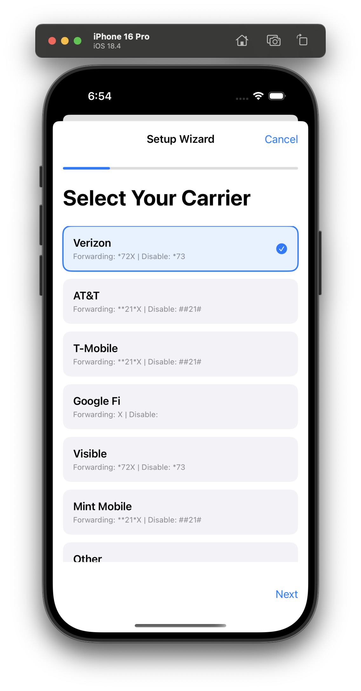

# Flight Forwarder 🛫

An open-source iOS app that generates custom Apple Shortcuts for intelligent call forwarding based on flight detection.





## ⚠️ WORK IN PROGRESS

**🚧 This app is currently in development and has NOT been tested on real devices yet!**

- ❌ **Not tested on physical iPhone/iPad**
- ❌ **Shortcut generation not fully implemented**
- ❌ **Carrier detection needs real-world testing**
- ❌ **Call forwarding codes may need adjustment**
- ⚠️ **Use at your own risk - test thoroughly before relying on it**

## TODOs

### High Priority
- [ ] **Test on real iPhone devices** - Currently only built/tested in simulator
- [ ] **Implement proper shortcut file generation** - Export functionality is stubbed
- [ ] **Test carrier detection** with real SIM cards and carriers
- [ ] **Verify call forwarding codes** work with actual carriers
- [ ] **Add proper error handling** for edge cases
- [ ] **Test calendar/location/wallet detection** with real data

### Medium Priority
- [ ] **Add app icon** and proper branding
- [ ] **Improve UI/UX** based on real device testing
- [ ] **Add unit tests** for core functionality
- [ ] **Add internationalization** support
- [ ] **Optimize for iPad** layouts
- [ ] **Add accessibility features**

### Low Priority
- [ ] **Add analytics** (privacy-respecting)
- [ ] **Create documentation** and user guides
- [ ] **Set up CI/CD** pipeline
- [ ] **Add crash reporting**
- [ ] **Performance optimizations**

## Overview

Flight Forwarder solves the complexity of creating advanced Apple Shortcuts by providing a native iOS app that generates simple, personalized shortcuts tailored to each user's specific carrier and preferences. Instead of distributing one complex shortcut that tries to work for everyone, this app creates streamlined shortcuts with only the necessary actions for each user.

## Key Features

### Smart Configuration
- **Automatic Carrier Detection**: Detects your carrier (Verizon, AT&T, T-Mobile, Google Fi, Visible, Mint Mobile)
- **Phone Number Validation**: Ensures proper formatting with country code support
- **Multiple Detection Methods**: 
  - Calendar events (flight keywords, airline codes)
  - Location detection (airports)
  - Apple Wallet boarding passes

### Personalized Export
- Generates shortcuts with 10-20 actions instead of 100+
- Carrier-specific forwarding codes
- No dependencies after generation
- Works on any iOS device with Shortcuts app

### Privacy First
- All processing happens locally on device
- No analytics or telemetry
- No internet connection required
- Open source under AGPL v3 license

## Installation

### Requirements
- iOS 15.0+
- Xcode 15.0+ (for building from source)
- Apple Developer account (for device installation)

### From Source
1. Clone this repository
   ```bash
   git clone https://github.com/yourusername/flight-forwarder.git
   cd flight-forwarder
   ```

2. Open in Xcode
   ```bash
   open FlightForwarder.xcodeproj
   ```

3. Configure signing
   - Select your development team in Project Settings
   - Update bundle identifier if needed

4. Build and run on your device

## Usage

⚠️ **Note: These steps are theoretical - not yet tested on real devices!**

1. **Initial Setup**
   - Launch the app
   - Complete the setup wizard
   - Confirm your carrier (auto-detected)
   - Enter forwarding phone number
   - Select detection methods
   - Choose preferences

2. **Export Shortcut**
   - Preview your configuration
   - Tap "Export Shortcut"
   - Save to Files or open in Shortcuts
   - Import into Shortcuts app

3. **Set Up Automation** (Optional)
   - In Shortcuts app, create new Automation
   - Choose trigger (arrive at location, time, etc.)
   - Run your exported Flight Forwarder shortcut
   - Enable automation

## Carrier Support

| Carrier | Enable Code | Disable Code | Status |
|---------|------------|--------------|--------|
| Verizon | *72[number] | *73 | ⚠️ Needs testing |
| AT&T | **21*[number]# | ##21# | ⚠️ Needs testing |
| T-Mobile | **21*[number]# | ##21# | ⚠️ Needs testing |
| Google Fi | App/Website | App/Website | ⚠️ Needs testing |
| Visible | *72[number] | *73 | ⚠️ Needs testing |
| Mint Mobile | **21*[number]# | ##21# | ⚠️ Needs testing |

## Architecture

### Project Structure
```
FlightForwarder/
├── Models/
│   ├── CarrierType.swift          # Carrier definitions and codes
│   └── UserConfiguration.swift   # User settings model
├── Views/
│   ├── ContentView.swift         # Main navigation
│   ├── WelcomeView.swift         # First-time user onboarding
│   ├── SetupWizardView.swift     # Step-by-step configuration
│   ├── PreviewView.swift         # Show generated shortcut preview
│   ├── ExportView.swift          # Share shortcut with instructions
│   └── SettingsView.swift        # Modify existing configuration
├── Core/
│   ├── ConfigurationManager.swift # Handle user preferences
│   └── ShortcutGenerator.swift    # Generate shortcut actions
└── FlightForwarderApp.swift       # Main app entry point
```

### Technical Stack
- **SwiftUI** for modern, declarative UI
- **Core Telephony** for carrier detection
- **UserDefaults** for storing user preferences
- **ShareSheet** for shortcut export
- **iOS 15+** for modern Shortcuts features

## Flight Detection Methods

### Calendar Scanning
- Keywords: "flight", "departure", "arrival", "boarding", "gate", "terminal"
- Flight Numbers: Regex pattern [A-Z]{2}[0-9]{1,4} (e.g., "AA1234", "DL567")
- Airlines: Major carrier names and codes
- International Detection: Country names, "international" keyword, long flight durations

### Location Detection
- Airport Categories: Use MapKit to detect "Airport" point of interest category
- Address Keywords: "airport", "terminal", "gate", "departure", "arrival"
- Proximity: Within reasonable distance of known airport coordinates

### Apple Wallet
- Boarding pass detection
- Flight information extraction
- Multi-leg journey support

## Contributing

🚧 **This project is in early development!** Contributions are welcome, especially:

- **Real device testing** and bug reports
- **Carrier code verification** for different providers
- **UI/UX improvements** based on actual usage
- **Additional carrier support**
- **Internationalization**
- **Documentation improvements**

### Development Setup
1. Fork the repository
2. Create a feature branch (`git checkout -b feature/amazing-feature`)
3. Commit your changes (`git commit -m 'Add amazing feature'`)
4. Push to the branch (`git push origin feature/amazing-feature`)
5. Open a Pull Request

## Disclaimer

⚠️ **IMPORTANT**: This app is experimental and unfinished. Do not rely on it for critical travel situations without thorough testing. Call forwarding can interfere with important calls, and this app may not work as expected.

- Test thoroughly in a safe environment first
- Verify call forwarding codes work with your specific carrier
- Have backup plans for important calls during travel
- The developers are not responsible for missed calls or carrier charges

## License

This project is licensed under the GNU Affero General Public License v3.0 - see the [LICENSE](LICENSE) file for details.

## Acknowledgments

- Apple Shortcuts team for the powerful automation framework
- Business travelers who provided the initial use case
- Contributors and testers from the iOS community
- Claude Code for rapid prototyping and development

---

**Made with ❤️ for the iOS community** (but not tested yet! 😅)

⚠️ **Remember: This is a work in progress - test everything before depending on it!**